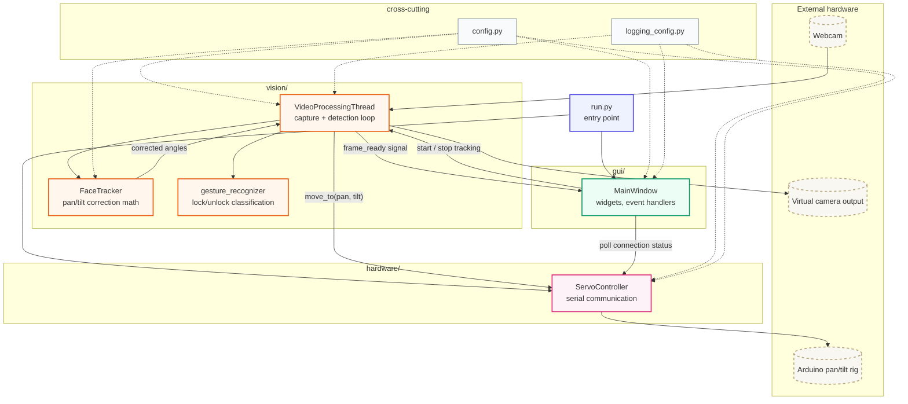

# FazeTrak

A PyQt5 desktop application for webcam-based face and hand-gesture tracking.
It uses OpenCV and MediaPipe to detect a face and hand gestures, mirrors the
annotated video to a virtual camera, and (optionally) drives a pan/tilt servo
rig over serial to physically follow the detected face.

## How it works

- Show an **open palm** to lock tracking on; the servo rig will follow your
  face.
- Show a **closed fist** to unlock tracking.
- If your face isn't seen for a few seconds while locked, the rig recenters
  and unlocks automatically.
- The Arduino connection status is shown at the bottom of the window and
  refreshes automatically.

## Project structure

```
fazetrak/
├── run.py                       # Entry point: python run.py
├── requirements.txt
├── pyproject.toml               # Optional: `pip install -e .` for an installable package
├── src/
│   └── fazetrak/
│       ├── config.py            # All tunable constants in one place
│       ├── logging_config.py    # Console + rotating file logging setup
│       ├── gui/
│       │   └── main_window.py   # Qt main window, widgets, and event handlers
│       ├── vision/
│       │   ├── video_processor.py    # Camera capture + detection loop (QThread)
│       │   ├── face_tracker.py       # Pure pan/tilt correction math (unit-testable)
│       │   └── gesture_recognizer.py # Lock/unlock hand-gesture classification
│       └── hardware/
│           └── servo_controller.py   # Serial communication with the Arduino rig
└── logs/                         # Created automatically; rotating log files
```

Each layer only depends on the ones below it: `gui` depends on `vision` and
`hardware`; `vision` depends on `hardware` only through the `ServoController`
interface it's given; `hardware` and `face_tracker` have no GUI/camera
dependencies at all, which is what makes them straightforward to unit test.

### Architecture Data Flow



## Setup

```bash
pip install -r requirements.txt
```

## Run

```bash
python run.py
```

## Logs

Logs are written both to the console and to `logs/fazetrak.log` (rotated
automatically at 2 MB, keeping the last 3 files). Adjust the verbosity by
changing the `level` passed to `configure_logging()` in `run.py`.

## Notes on hardware requirements

- A webcam is required at the camera index configured in
  `config.CAMERA_INDEX` (default: `1`).
- A virtual camera output device is required (e.g. via `v4l2loopback` on
  Linux, or OBS Virtual Camera on Windows/macOS) for `pyvirtualcam` to work.
- The Arduino pan/tilt rig is optional — if it isn't connected, the app runs
  normally and simply reports "Not Connected" without crashing.

## Fixed issues (from the previous version)

1. **App would crash silently on launch with no visible error.** This was
   caused by `mediapipe`'s dependency on `opencv-contrib-python`, which
   bundles its own Qt platform plugins and hijacks
   `QT_QPA_PLATFORM_PLUGIN_PATH` on import, pointing PyQt5 at an incompatible
   plugin set. `run.py` now clears that environment variable before creating
   the `QApplication`.
2. **The app required a working camera and virtual camera device just to
   open the window.** The video processing thread is now created lazily,
   the first time "Start Tracking" is clicked, instead of eagerly in the
   window's constructor.
3. **`pyserial` was missing from `requirements.txt`** even though
   `servo_controller.py` depends on it (`import serial`). It's now listed
   explicitly.
